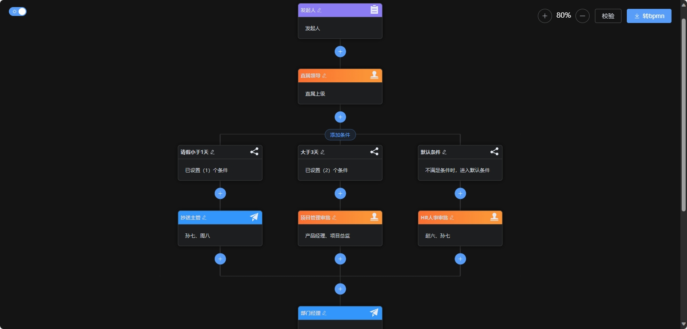
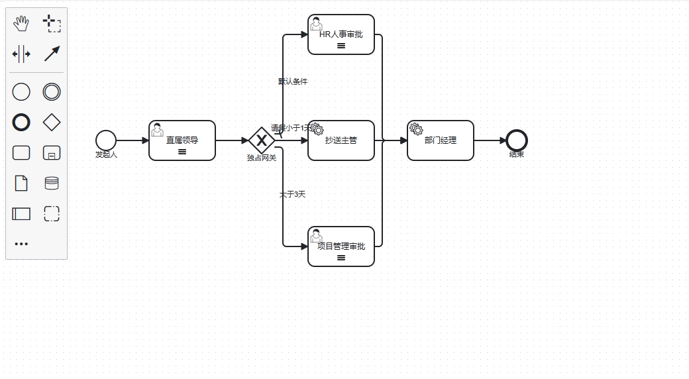
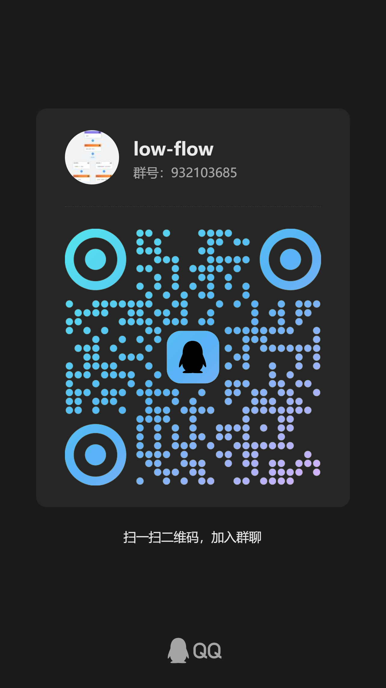

<div align="center">
  <h1>lowflow-design-converter</h1>
  <p>Convert low-code process definitions into Flowable-compatible BPMN 2.0 XML.</p>

  <p>
    <strong>English</strong> · <a href="README.zh-CN.md">简体中文</a>
  </p>

  <p>
    
    
    
    
    
  </p>
</div>

## Overview

`lowflow-design-converter` is the backend converter for the [lowflow-design](https://github.com/tsai996/lowflow-design) visual process designer. It accepts a JSON process tree, builds a Flowable BPMN model, applies automatic layout, and returns a downloadable `.bpmn20.xml` file.

- JSON-to-BPMN 2.0 conversion
- Automatic diagram layout with Flowable
- REST endpoint for direct XML download
- Flowable implementation on `main`; Activiti implementation on `activiti`

## Quick start

Requirements: JDK 8 and Maven 3.6+.

```bash
git clone https://github.com/tsai996/lowflow-design-converter.git
cd lowflow-design-converter
mvn org.springframework.boot:spring-boot-maven-plugin:2.3.12.RELEASE:run
```

You can also run `com.lowflow.LowflowApplication` directly from your IDE. The service starts at `http://localhost:8080/lowflow`.

## API

### Download BPMN XML

```text
POST /lowflow/model/download
Content-Type: application/json
```

Create a minimal `process.json`:

```json
{
  "code": "leave-process",
  "name": "Leave request",
  "remark": "Minimal start-to-end process",
  "process": {
    "id": "start",
    "type": "start",
    "name": "Start",
    "next": {
      "id": "end",
      "pid": "start",
      "type": "end",
      "name": "End"
    }
  }
}
```

Send it to the converter:

```bash
curl -X POST "http://localhost:8080/lowflow/model/download" \
  -H "Content-Type: application/json" \
  --data-binary @process.json \
  --output leave-process.bpmn20.xml
```

The response is an XML attachment. Its filename is derived from the process `name`.

## Supported nodes

| JSON `type` | BPMN element |
|---|---|
| `start` | Start event |
| `approval` | User task |
| `cc` | Service task using `${ccDelegate}` |
| `exclusive` | Exclusive gateway |
| `condition` | Conditional sequence flow |
| `timer` | Intermediate timer catch event |
| `notify` | Async service task using `${notifyDelegate}` |
| `service` | Configurable service task |
| `end` | End event |

Notes:

- Connect sequential nodes with `next`; each child node's `pid` must match its parent node's `id`.
- `condition` nodes are branches of an `exclusive` node.
- The parallel node class is currently unfinished and is not registered as a supported JSON type.
- Projects deploying generated XML must provide the `ccDelegate` and `notifyDelegate` beans when those node types are used.

## Project structure

```text
src/main/java/com/lowflow/
├── LowflowApplication.java          # Spring Boot entry point
├── controller/
│   └── ProcessModelController.java  # Conversion download endpoint
└── pojo/
    ├── ProcessModel.java            # JSON model to BPMN conversion
    ├── condition/                    # Conditional expression models
    ├── enums/                        # Node option enums
    └── node/                         # BPMN node converters
```

## Demos and related projects

- [Online designer](https://tsai996.github.io/lowflow-design/)
- [Product demo](https://demo.lowflow.vip/)

| Host | Converter backend | Designer frontend |
|---|---|---|
| GitHub | [lowflow-design-converter](https://github.com/tsai996/lowflow-design-converter) | [lowflow-design](https://github.com/tsai996/lowflow-design) |
| Gitee | [lowflow-design-converter](https://gitee.com/cai_xiao_feng/lowflow-design-converter) | [lowflow-design](https://gitee.com/cai_xiao_feng/lowflow-design) |

### Conversion preview

<p align="center">
  
  
</p>

## Community

Add the WeChat contact below and include “join group” in your request, or join the QQ group directly.

<p>
  
  
</p>

**Job referrals are welcome.**

## Sponsor

If this project helps you, you can support its maintenance by buying the author a milk tea.

<p>
  
  
</p>

## Recommended reading

[*In-Depth Flowable Process Engine: Core Principles and Advanced Practice*](https://item.jd.com/14804836.html), by He Bo, includes a foreword by Flowable founder Tijs Rademakers and covers Flowable from fundamentals to advanced use.


## License

Licensed under the [GNU General Public License v3.0](LICENSE).
